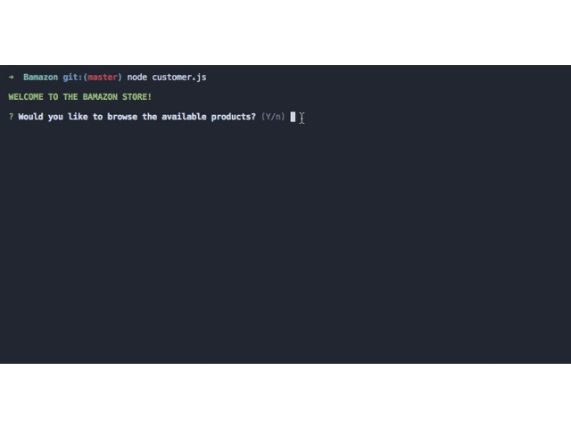

# Bamazon

Sandy Yeung

Bamazon is a command line node application using MySQL and npm packages to create an Amazon-like storefront.

## Technologies used
- Node.js - Download the latest version of Node https://nodejs.org/en/
- inquirer NPM Package - https://www.npmjs.com/package/inquirer
- mysql NPM Package - https://www.npmjs.com/package/mysql
- tables NPM Package - https://www.npmjs.com/package/console.table
- colors NPM Package - https://www.npmjs.com/package/colors

## Built With

* Visual Studio Code - Text Editor

## Authors

* **Sandy Yeung** - *JS/Node.js* - [Github](https://github.com/Sandynism)